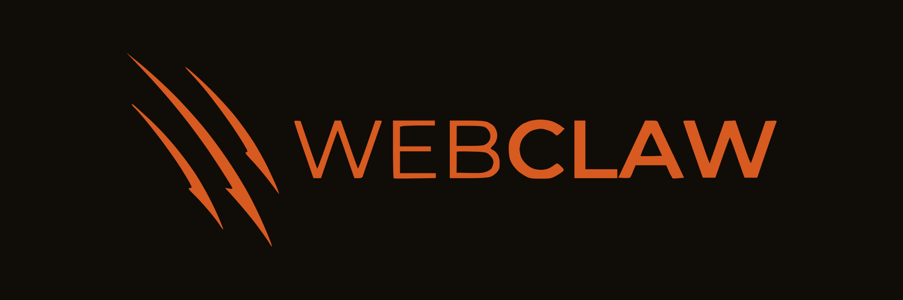

<p align="center">
  <a href="https://webclaw.io">
    
  </a>
</p>

<p align="center">
  <strong>Python SDK for the Webclaw web extraction API</strong>
</p>

<p align="center">
  <a href="https://pypi.org/project/webclaw"></a>
  <a href="https://pypi.org/project/webclaw"></a>
  <a href="https://github.com/0xMassi/webclaw-python/blob/main/LICENSE"></a>
</p>

---

> **Note**: The webclaw Cloud API is currently in closed beta. [Request early access](https://webclaw.io) or use the [open-source CLI/MCP](https://github.com/0xMassi/webclaw) for local extraction.

---

## Installation

```bash
pip install webclaw
```

Requires Python 3.9+. The only dependency is [httpx](https://www.python-httpx.org/).

## Quick Start

### Sync

```python
from webclaw import Webclaw

client = Webclaw("wc-YOUR_API_KEY")

result = client.scrape("https://example.com", formats=["markdown"])
print(result.markdown)
```

### Async

```python
from webclaw import AsyncWebclaw

async with AsyncWebclaw("wc-YOUR_API_KEY") as client:
    result = await client.scrape("https://example.com", formats=["markdown"])
    print(result.markdown)
```

Both clients support identical method signatures. Every sync method has an async equivalent. The examples below use the sync client for brevity.

## Endpoints

### Scrape

Extract content from a single URL. Supports multiple output formats: `"markdown"`, `"text"`, `"llm"`, `"json"`.

```python
result = client.scrape(
    "https://example.com",
    formats=["markdown", "text", "llm"],
    include_selectors=["article", ".content"],
    exclude_selectors=["nav", "footer"],
    only_main_content=True,
    no_cache=True,
)

result.url        # str
result.markdown   # str | None
result.text       # str | None
result.llm        # str | None
result.json_data  # Any | None
result.metadata   # dict
result.cache      # CacheInfo | None  (.status: "hit" | "miss" | "bypass")
result.warning    # str | None
```

### Search

Web search with optional topic filtering.

```python
results = client.search("web scraping tools 2026", num_results=10, topic="tech")

for r in results["results"]:
    print(r["title"], r["url"])
```

**Parameters:** `query` (str), `num_results` (int, optional), `topic` (str, optional).

### Map

Discover URLs via sitemap.

```python
result = client.map("https://example.com")

print(result.count)
for url in result.urls:
    print(url)
```

### Batch

Scrape multiple URLs in parallel.

```python
result = client.batch(
    ["https://a.com", "https://b.com", "https://c.com"],
    formats=["markdown"],
    concurrency=5,
)

for item in result.results:
    print(item.url, item.markdown, item.error or "ok")
```

**Parameters:** `urls` (list[str]), `formats` (optional), `concurrency` (int, default 5).

### Extract

LLM-powered structured data extraction. Use either a JSON schema or a natural language prompt.

```python
# Schema-based extraction
result = client.extract(
    "https://example.com/pricing",
    schema={
        "type": "object",
        "properties": {
            "plans": {
                "type": "array",
                "items": {
                    "type": "object",
                    "properties": {
                        "name": {"type": "string"},
                        "price": {"type": "string"},
                    },
                },
            }
        },
    },
)
print(result.data)  # dict matching your schema

# Prompt-based extraction
result = client.extract(
    "https://example.com/pricing",
    prompt="Extract all pricing tiers with names and monthly prices",
)
print(result.data)
```

### Summarize

Summarize page content with an optional sentence limit.

```python
result = client.summarize("https://example.com", max_sentences=3)
print(result.summary)
```

### Diff

Detect content changes at a URL since the last check.

```python
result = client.diff("https://example.com/status")

print(result["has_changed"])  # bool
print(result["diff"])         # str, unified diff of changes
```

### Brand

Extract brand identity (colors, fonts, logos) from a URL.

```python
result = client.brand("https://example.com")
print(result.data)  # dict with brand identity fields
```

### Agent Scrape

AI-guided scraping that navigates a page to achieve a specified goal.

```python
result = client.agent_scrape(
    "https://example.com/dashboard",
    goal="Find the monthly active users count",
)

print(result["result"])
print(result["steps"])
```

**Parameters:** `url` (str), `goal` (str), plus optional keyword arguments forwarded to the API.

### Research

Deep research that searches, reads, and synthesizes information from multiple sources. This is an async job: the SDK starts it and polls until completion.

```python
# Blocks until research completes (up to 600s, or 1200s with deep=True)
result = client.research(
    "How do modern web crawlers handle JavaScript rendering?",
    max_sources=15,
    deep=True,
    topic="tech",
)

print(result.report)
print(result.iterations)
print(result.elapsed_ms)

for source in result.sources:
    print(source["url"], source["title"])
```

To check status without blocking:

```python
status = client.get_research_status("job-id-here")
print(status.status)  # "running" | "completed" | "failed"
```

**Parameters:** `query` (str), `deep` (bool, default False), `max_sources` (int, optional), `max_iterations` (int, optional), `topic` (str, optional).

### Crawl

Start an async crawl that follows links from a seed URL.

```python
job = client.crawl(
    "https://example.com",
    max_depth=3,
    max_pages=100,
    use_sitemap=True,
)

# Poll until complete (default timeout 300s)
status = job.wait(interval=2.0, timeout=300.0)

print(status.total, status.completed, status.errors)
for page in status.pages:
    print(page.url, len(page.markdown or ""))
```

Check status without waiting:

```python
status = job.get_status()
print(status.status)  # "running" | "completed" | "failed"
```

Async variant:

```python
job = await client.crawl("https://example.com", max_depth=2)
status = await job.wait()
```

### Watch

Monitor URLs for content changes with automatic periodic checks.

**Create a watch:**

```python
watch = client.watch_create(
    "https://example.com/pricing",
    name="Pricing page monitor",
    interval_minutes=60,
    webhook_url="https://hooks.example.com/webclaw",
)
print(watch.id, watch.status)
```

**List all watches:**

```python
result = client.watch_list(limit=50, offset=0)
for w in result.watches:
    print(w.id, w.url, w.name, w.last_checked)
print(result.total)
```

**Get a single watch:**

```python
watch = client.watch_get("watch-id-here")
print(watch.url, watch.interval_minutes)
```

**Delete a watch:**

```python
client.watch_delete("watch-id-here")
```

**Trigger an immediate check:**

```python
check = client.watch_check("watch-id-here")
print(check.has_changed)  # bool
print(check.diff)         # str | None
print(check.checked_at)   # ISO timestamp
```

## Error Handling

All errors inherit from `WebclawError`, which carries the HTTP status code when available.

```python
from webclaw import (
    WebclawError,
    AuthenticationError,
    NotFoundError,
    RateLimitError,
    TimeoutError,
)

try:
    result = client.scrape("https://example.com")
except AuthenticationError:
    print("Invalid or missing API key")
except RateLimitError:
    print("Too many requests, slow down")
except NotFoundError:
    print("Resource not found")
except TimeoutError as e:
    print(f"Operation timed out: {e}")
except WebclawError as e:
    print(f"API error (status {e.status_code}): {e}")
```

| Exception | HTTP Status | When |
|-----------|-------------|------|
| `AuthenticationError` | 401 / 403 | Invalid or missing API key |
| `NotFoundError` | 404 | Resource does not exist |
| `RateLimitError` | 429 | Too many requests |
| `TimeoutError` | -- | Crawl/research polling exceeded timeout |
| `WebclawError` | Any | Base class for all other API errors |

## Configuration

```python
import os
from webclaw import Webclaw

client = Webclaw(
    os.environ["WEBCLAW_API_KEY"],
    base_url="https://api.webclaw.io",  # default
    timeout=60.0,                        # seconds, default 30
)
```

Both `Webclaw` and `AsyncWebclaw` support context managers for automatic cleanup:

```python
# Sync
with Webclaw("wc-YOUR_API_KEY") as client:
    result = client.scrape("https://example.com")

# Async
async with AsyncWebclaw("wc-YOUR_API_KEY") as client:
    result = await client.scrape("https://example.com")
```

## Async Usage

Every endpoint is available on `AsyncWebclaw` with identical parameters. Use `await` on all method calls and `async with` for the context manager.

```python
import asyncio
from webclaw import AsyncWebclaw

async def main():
    async with AsyncWebclaw("wc-YOUR_API_KEY") as client:
        # Run multiple scrapes concurrently
        results = await asyncio.gather(
            client.scrape("https://a.com", formats=["markdown"]),
            client.scrape("https://b.com", formats=["markdown"]),
            client.scrape("https://c.com", formats=["markdown"]),
        )
        for r in results:
            print(r.url, len(r.markdown or ""))

asyncio.run(main())
```

## Type Support

This package ships with a `py.typed` marker (PEP 561). Type checkers like mypy and pyright will pick up all type annotations automatically. All response types are dataclasses importable from the top-level package:

```python
from webclaw import ScrapeResponse, CrawlStatus, MapResponse, ExtractResponse
```

## License

MIT
